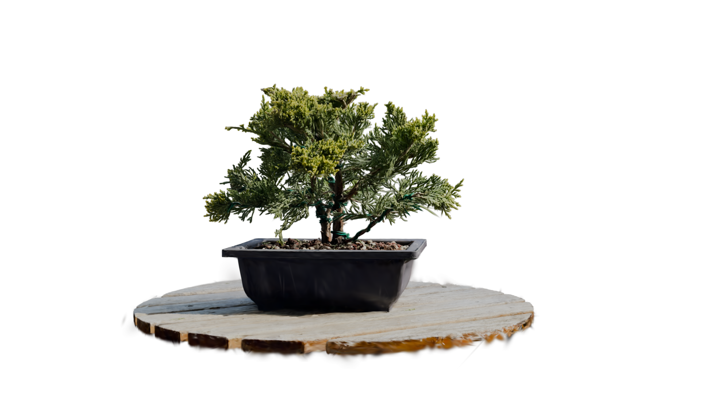
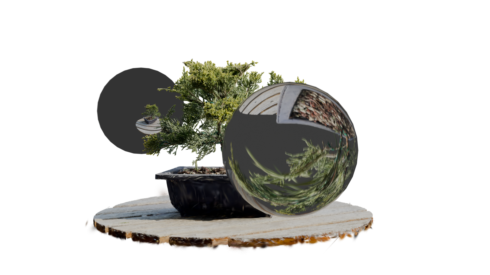

# 3D Gaussian Ray Tracing in Blender

A Blender implementation of the **3D Gaussian Ray Tracing** rendering technique using Geometry Nodes and Shader Nodes, enabling raytracing of Gaussian splats directly within Blender's Cycles renderer.

## Overview

This project implements the rendering engine described in the research paper **"3D Gaussian Ray Tracing: Fast Tracing of Particle Scenes"** by Moenne-Loccoz et al. (2024). It allows you to raytrace 3D Gaussian splats natively in Blender using Cycles, and leverage Gaussian splatting in a potential VFX pipeline.

<div align="center">
  <table>
    <tr>
      <td align="center">
        
        <br/>
        <b>Rasterized Rendering</b>
        <br/>
        <em>Traditional Gaussian splatting rasterization</em>
      </td>
      <td align="center">
        
        <br/>
        <b>Raytraced Rendering</b>
        <br/>
        <em>3D Gaussian ray tracing with Cycles. Same scene + additional glossy and glass spheres.</em>
      </td>
    </tr>
  </table>
</div>

The main feature of this technique is indeed to me the possibility to handle reflections, refractions, motion blur, bokeh with gaussian splatting precision.

One can notice that the reconstruction is not similar compared to the rasterized version. Indeed, i should ghave finetuned the GS scene with a raytracer rendering engine like Moenne-Loccoz et al. (2024) suggest.

## Use-case exemple

Here is a use case I though of for this technique : integration of a glossy 3D object that moves between detailed object.
In this context, a rough rotoscopie does not provide enough detail while an HDRI would not allow the sphere to move freely through the scene. 
Thus It seems to me that raytracing gaussian splats is in this context one of the best pipeline one can come up with.


### pipeline description

#### On set
1. Shoot
2. Scan the scene (don't forget the ceiling like I did)

#### Post Production
3. Track the scene in Blender
4. Train the Gaussian Splatting scene
5. Align the GS Scene to the track in Blender (one can use the provided align_transform.py script)
6. Render the glossy element
7. Compose the original shot with the 3D rendred glossy element

## Usage

### Import the Material and geometry
1. Clone or download this repository:
   ```bash
   git clone <your-repo-url>
   ```

2. From blender, in use file/append and select

3. Find the downloaded Gaussian_Raytraced.blend

4. Select 
    - Splat_Shader in the Material folder
    - Splat_Geometry in the NodeTree folder

### Apply on a pre-trained Gaussian Splatting scene

5. Use file/import/STANDFORD PLY (.ply) to import a pre-trained gaussian splatting scene

6. Give it the Splat_Shader Material and the Splat_Geometry geometry node tree.

### Render

7. Make sure to use Cycle

8. In "Light path" Cycle parameters, increase "Transparent" to 1024

9. The point cloud is now ready to be rendered directly with cycle, inderacting with anyother object in the scene. 


### Node Setup Explanation

#### Geometry Nodes
For each point in the point cloud, the geometry node tree:
- Create a Ico-Sphere
- Moves, Scales and rotates according to .ply data
- Adapt these transformations according to blender's object properties
- Provide this information to shader node tree
- Apply the proper shader.


#### Shader Nodes
For each ray crossing an Icosphere, the shader node :
- Compute the maximum opacity on its path according to Moenne-Loccoz's et al. (2024) paper.
- Compute Color according to ray directions
(I didn't not implement the blender object rotation influence over raydirection management, thus only the first order of spherical harmonics works for now)


### Limitations :

- The actual Moenne-Loccoz et al. (2024) implementations includes instancing and shadows projections which this cycle impementation does not.
- As explaned iun Moenne-Loccoz et al. (2024), each scene should be finetunned with a raytracing rendering method in order to be as accurate as possible with this redering method.
- Rendering is far from real time. The provided example frame was rendered on RTX 3080 in 2 minutes and 30 secondes. (most of the time is actually used to compute BVH and load everything in memory nevertheless). I recommand using a gaussian Rasterization Addon in order to setup the scene and only use raytracing for actual rendering.

## References

- **Original Paper**: Moenne-Loccoz, N., Mirzaei, A., Perel, O., de Lutio, R., Martinez Esturo, J., State, G., Fidler, S., Sharp, N., & Gojcic, Z. (2024). *3D Gaussian Ray Tracing: Fast Tracing of Particle Scenes*. arXiv:2407.07090 [cs.GR]. [https://arxiv.org/abs/2407.07090](https://arxiv.org/abs/2407.07090)
- **3D Gaussian Splatting**: The foundational technique for representing scenes with Gaussian primitives
- **Blender Cycles**: [Official Cycles Documentation](https://docs.blender.org/manual/en/latest/render/cycles/index.html)

